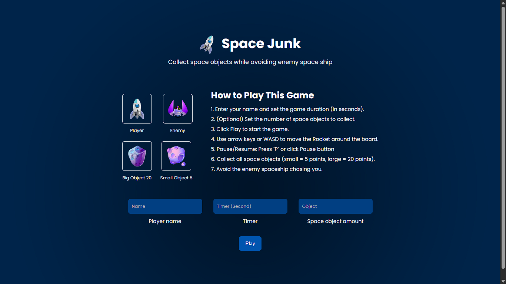

# 🚀 Space Junk Game - Game Arcade Mini Berbasis Web

---

## 📝 Deskripsi

**Space Junk Game** adalah game arcade sederhana berbasis website dengan tema luar angkasa.  
Pemain ditantang untuk menghindari berbagai **sampah antariksa (space junk)** sambil mengendalikan pesawat luar angkasa agar tidak menabrak.  
Gameplay yang simpel namun seru, cocok untuk mengisi waktu luang.

Dibuat dengan teknologi dasar **HTML, CSS, dan JavaScript murni** tanpa library atau framework tambahan.

---

## 🚀 Teknologi yang Digunakan

| Teknologi  | Deskripsi Singkat |
|------------|-------------------|
|  **HTML5** | Struktur utama halaman game. |
|  **CSS3** | Styling dan animasi sederhana untuk tampilan game. |
|  **JavaScript** | Logic game, collision detection, dan gameplay. |

---

## ✨ Fitur Utama

### 🕹️ 1. Gameplay Sederhana & Seru
- Hindari **space junk** sebanyak mungkin.
- Skor akan bertambah semakin lama bertahan.

---

### 🚀 2. Tema Luar Angkasa
Menghadirkan suasana luar angkasa yang ringan, fun, dan mudah dimainkan siapa saja.

---

### 🌐 3. Responsive Design
Bisa dimainkan langsung dari **desktop maupun smartphone** tanpa instalasi aplikasi.

---

## 🎯 **Tujuan Project**
- Meningkatkan skill JavaScript melalui pembuatan game kecil.
- Membuat game berbasis web yang ringan dan mudah diakses.
- Sebagai media pembelajaran canvas, animasi, dan logic dasar game.

---

## 📝 Penutup
**Space Junk Game** dibangun dengan teknologi sederhana namun tetap memberikan pengalaman bermain yang menyenangkan dan ringan dimainkan dari berbagai perangkat.

---
